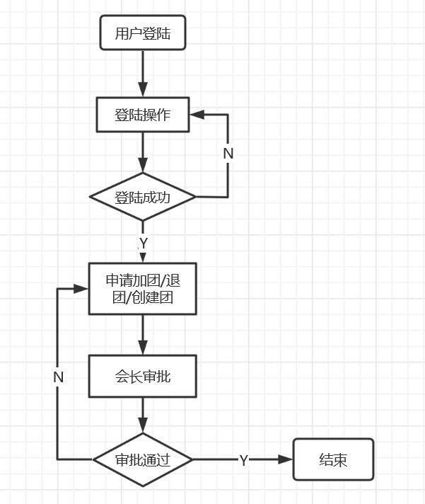
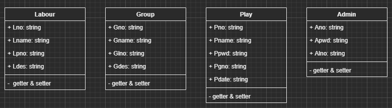

# 工会人员管理系统设计说明书

| 日期 | 修订版本 | 描述 | 修改人 |
| ------ | ------ | ------ | ------ |
| 2020/5/24 | 1.0 | 初步设计方案 | 秦浩 |

[TOC]

## 1 引言

### 1.1 编写目的

1. 本说明书目的在于明确说明系统各功能的实现方式，指导开发人员进行编码；
2. 本说明书的预期读者为：系统设计者、系统开发员。

### 1.2 背景

1. 待开发软件系统的名称：工会人员管理系统；
2. 此软件系统任务提出者：第八小组；
3. 此软件系统任务开发者：第七小组；
4. 此软件系统任务用户：需要使用人员管理功能的管理人员以及普通成员。

### 1.3 基线

工会人员管理系统需求分析说明书V1.0

### 1.4 特殊名词定义

1. 管理人员：需要对人员进行管理的系统管理员；
2. 普通成员：使用系统并且已注册和登录的工会成员。

### 1.5 参考材料

1. 属于本项目的其他已发表的文件；
2. 本文件中引用的其他文献、资料以及软件开发标准。

### 1.6 相关工具

1. 系统设计工具：Visio 2007、Visual Studio Code + Draw.io Integration插件 等；
2. 系统开发工具：Eclipse 2020.3、Tomcat 8.5、SQL Server 2017、SQL Server Management Studio 2017 等。

## 2 设计概述

### 2.1 任务和目标

1. 满足客户需要，提供基本的人员管理功能；
2. 前端界面简洁易用，提供良好的人机交互体验。

### 2.2 运行环境概述

云服务器（待定）

## 3 设计与开发规范

### 3.1 界面设计原则

1. 以用户为中心：Theo Mandel博士创造了人机交互的“黄金三原则”：置于用户控制之下；保持界面一致性；减轻用户的记忆负担；
2. 拥有良好的直觉特征：以用户所熟悉的现实世界事务的抽象来给用户暗示和隐喻，来帮助用户快速地学会使用软件；
3. 较快的响应速度；
4. 简单且美观。

### 3.2 面向对象程序设计原则

1. 单一职责原则（SRP）：就一个类而言，应该仅有一个引起它变化的原因。
2. 里氏替换原则（LSP）：子类型（subtype）必须能够替换掉它们的基类型。
3. 依赖倒置原则（DIP）：
    - 高层模块不应该依赖于低层模块，两者都应该依赖于抽象。
    - 抽象不应该依赖于细节，细节应该依赖于抽象。
4. 接口隔离原则（ISP）：不应该强迫客户依赖于它们不要的方法。接口属于客户，不属于它所在的类层次结构。
5. 开闭原则（OCP）：软件实体（类、模块、函数等）应该是可以扩展的，但是不可修改的。
6. 迪米特原则（LoD）：也叫最少知识原则，即一个软件是他应当尽可能少地于其他实体发生相互作用，模块之间的交互要少。

### 3.3 编码规范

#### 3.3.1 模块命名

每一个模块分一个包，包名以包名的英文单词命名。小模块依次放在所属的大模块下面，也是以模块的英文单词来命名。

#### 3.3.2 类命名

1. 数据访问类，用驼峰式命名法，首字母小写，以业务名称开头，Dao结尾，例如UserDao.java。
2. 业务逻辑类，用驼峰式命名法，首字母大写，以业务名称开头，Service结尾，例如UserService.java。
3. 业务控制类，用驼峰式命名法，首字母大写，以业务名称开头，Servlet结尾，例子如UserServlet.cs。

#### 3.3.3 变量命名

要以有意义的命名的方式来为变量命名，并且单词首字母小写，以驼峰式命名法。

#### 3.3.4 过程函数命名

1. 要以有意义的命名的方式来为函数命名，并且单词首字母小写，以驼峰式命名法；
2. 清晰的代码结构和详细的注释。

## 4 详细设计

### 4.1 系统架构

经典三层架构

### 4.2 业务流程

### 4.3 前端界面设计

TODO:待完成

### 4.4 数据库设计

1. 工会表

| 字段名 | 字段类型 | 宽度 |
| ------ | ------ | ------ |
| 公会号 | CHAR | 4 |
| 公会名 | CHAR | 20 |
| 会长号 | CHAR | 9 |
| 公会描述 | CHAR | 100 |

2. 团表

| 字段名 | 字段类型 | 宽度 |
| ------ | ------ | ------ |
| 团号 | CHAR | 4 |
| 团名 | CHAR | 20 |
| 团长号 | CHAR | 9 |
| 公会号 | CHAR | 4 |
| 团描述 | CHAR | 100 |

3. 玩家表

| 字段名 | 字段类型 | 宽度 |
| ------ | ------ | ------ |
| 玩家号 | CHAR | 9 |
| 玩家名 | CHAR | 20 |
| 玩家密码 | CHAR | 15 |
| 团号 | CHAR | 4 |
| 入团时间 | DATE | 自动 |

4. 管理员表

| 字段名 | 字段类型 | 宽度 |
| ------ | ------ | ------ |
| 管理员号 | CHAR | 9 |
| 管理员密码 | CHAR | 15 |
| 工会号 | CHAR | 4 |

### 4.5 类设计

## 5 安全性设计

### 5.1 用户权限

1. 普通玩家可以查看自己的信息；
2. 管理员可以指定团长以及调整人员所属团体。
