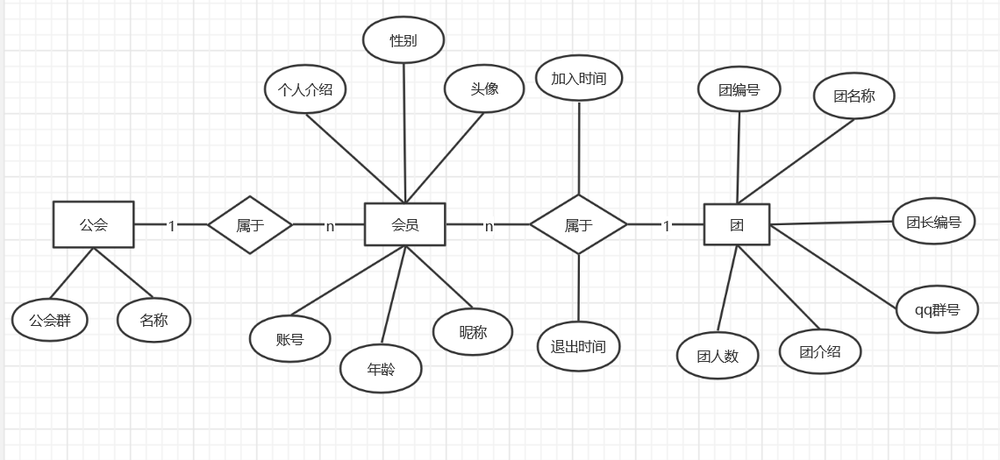

# 人员管理系统需求说明书

## 1.引言与任务概述

### 1.1 项目背景与目标

有很多游戏中的任务需要团体共同完成，但是有时候找到这么一个群体又有些费力，本系统的设计目的是实现一个网站平台，用户可以根据自身需求和团体描述申请加入或创建团，以达到具有同样需求的用户组合起来的目的。

### 1.2 运行环境

软件环境：Eclipse、Tomcat、浏览器、sql server数据库管理系统

## 2.数据描述

### 2.1 静态数据描述

#### 2.1.1 E-R图

#### 2.1.2表数据

(1) 账名-密码表

| 字段名 | 字段类型 | 宽度 |
| :---: | :----:| :----:|
| 账号  | char   | 15   |
| 密码  | char   |  15  |

(2) 公会信息表

| 字段名 | 字段类型 | 宽度  |
| :----- | :-----: | :----: |
| 公会群 | char   | 15 |
| 公会名 | varchar | 15 |
| 公会描述 | text |  100|

(3) 会员信息表

| 字段名| 字段类型 | 宽度 |
| :-----: | :----: |:----:|
| 账号    | char    |  15   |
| 年龄    | smallInt|  自动 |
| 昵称    | varchar | 10   |
|  性别   | char    | 2     |
| 个人介绍 | text   | 100    |
| 头像    |  image  | 自动|

(4)会员-团体表

| 字段名| 字段类型 | 宽度 |
| :-----: | :----: |:----:|
|  账号（外码）|char | 15|
| 团编号（外码） | char | 15   |
| 加入时间 | date | 自动|
| 退团时间 | date |自动|

（5）团体表

| 字段名| 字段类型 | 宽度 |
| :-----: | :----: |:----:|
|团编号   |   char  | 15 |
| 团名称 |   varchar | 15|
|团长账号(外码)| char  |15   |
| qq群号 |char | 15|
|团介绍 | text| 100|
|团人数| smallint| 自动|

### 2.2动态数据

输入：菜单选项、查询字段值、新建记录项
输出：在数据库中查询的或更新的数据

## 3.功能要求

### 3.1注册登陆模块

用户注册时必须指定唯一（不与数据库内现有用户名重复）的账号，可以是字母和数字或文字的组合，密码必须6-16位。

### 3.2 用户信息管理模块

显示用户曾加入的团的信息（团号、团名称、团描述），现如今加入的团的所有信息以及在其中的身份，显示除密码外的所有个人信息，并提供修改功能。

### 3.3 查询浏览模块

用户可以根据关键字查询所有团，并且可以在网站主页浏览到所有图的信息，只能看到团的团描述和团名称，其他信息不可见。

### 3.4团员申请模块

- 用户可以创建团，并填写团介绍、团名称、团编号（唯一）交由管理员审核，审核通过后即显示在网站主页里，申请者即为团长，若是团长，在申请通过后须填写团qq号。

- 用户可以加入团，填写加入申请理由，并交由管理员审核，管理员审核通过后该用户即属于团，在用户信息页需要显示该团的所有信息，若是目前团人数已经为12人，则该用户不能再申请该团。

- 用户可以直接退出团，不需要经过管理员的审核，若退出的用户为该团最后一个成员，则该团应该从数据库中直接删除。

### 3.5审核模块

- 该功能仅限管理员使用，管理员拿到用户的申请信息后，应该首先审核，若审核通过，则改变数据库的相应信息。

- 管理员可以撤销任何一个团。

## 4.性能需求

### 4.1 精确度需求

- 需要按照严格的数据要求进行输入，否则系统不予响应。

- 查询时应保证查全率，包含在关键字中的都应该查到，要提供模糊查询和直接查询。

### 4.2 时间特性需求

响应应该在1-2秒内完成。